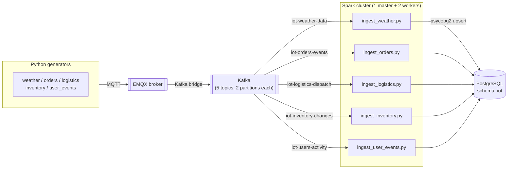
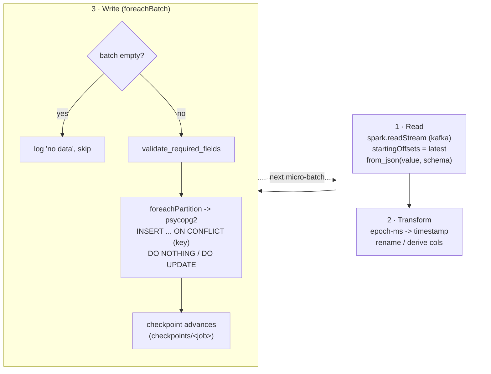

# Spark Structured Streaming Jobs

Five long-running **Spark Structured Streaming** jobs that ingest mock IoT data
from Kafka, transform it, and write it into PostgreSQL. Each job is an
independent Spark application that, once submitted, runs **forever** —
continuously processing new Kafka messages as they arrive until it is stopped
(there is no fixed schedule and no "finished" state).

> These are streaming jobs, **not** scheduled batch jobs. A healthy job that
> prints nothing and just sits there is normal — it's idling, waiting for new
> data.

---

## Pipeline at a glance



## What each job does internally

Every job follows the identical shape (the only differences are the topic,
the schema, the transform, and the target table/key):



Key points of the shared pattern:

- **Source**: `KafkaConfig.get_kafka_options()` — `startingOffsets=latest`
  (only new messages, backlog before job start is ignored),
  `failOnDataLoss=false`, `maxOffsetsPerTrigger=50000` (caps how much a single
  micro-batch pulls after downtime).
- **Parse**: `SchemaRegistry` provides the explicit JSON schema per data type;
  `from_json` turns the raw Kafka `value` into typed columns.
- **Write**: not Spark's JDBC writer (it has no upsert mode). Each job uses
  `foreachBatch → foreachPartition`, opens a raw **psycopg2** connection per
  partition, and issues `INSERT ... ON CONFLICT (<key>) DO NOTHING` (or
  `DO UPDATE` for logistics). This makes writes **idempotent** — a checkpoint
  replay or task retry re-inserting an already-written row is skipped instead of
  crashing on a duplicate key. See [TODO.md](../TODO.md) for the full rationale.
- **Progress**: tracked in each job's own checkpoint directory, **not** in Kafka
  consumer groups (Spark's Kafka source manages offsets itself).
- **Failure handling**: a write error re-raises (fail-fast) rather than being
  swallowed — the query crashes visibly instead of silently dropping data.

## The 5 jobs

| Job | Kafka topic | Postgres table | Conflict key | Strategy | Notes |
|-----|-------------|----------------|--------------|----------|-------|
| `ingest_weather.py` | `iot-weather-data` | `iot.weather_data` | `message_id` | `DO NOTHING` | epoch-ms → `recorded_at` |
| `ingest_orders.py` | `iot-orders-events` | `iot.sales_orders` | `order_id` | `DO NOTHING` | `item_count = size(items)`; `status → order_status` |
| `ingest_logistics.py` | `iot-logistics-dispatch` | `iot.logistics_shipments` | `shipment_id` | `DO UPDATE` | GPS lat/lon → POINT text; `shipment_id` recurs across tracking updates, so each update overwrites the row |
| `ingest_inventory.py` | `iot-inventory-changes` | `iot.inventory_changes` | `message_id` | `DO NOTHING` | epoch-ms → `changed_at` |
| `ingest_user_events.py` | `iot-users-activity` | `iot.user_events` | `message_id` | `DO NOTHING` | `page → page_or_resource` |

**Why the conflict key differs**: `order_id` (orders) and `shipment_id`
(logistics) are real, source-provided business-key UUIDs. `weather`,
`inventory`, and `user_events` have no natural per-message key, so their mock
generators emit a dedicated `message_id` UUID per message purely for
deduplication. `logistics` uses `DO UPDATE` (not `DO NOTHING`) because its
generator deliberately reuses a small pool of `shipment_id`s to simulate a
shipment's tracking history — each new message is a legitimate status/location
update that must overwrite the row, not be dropped.

## Shared code

- **`shared_utils/shared_utils.py`** — packaged into `shared_utils.zip` and
  shipped to executors via `--py-files`. Provides:
  - `SparkSessionFactory` — session builder, and `get_psycopg2_dsn()` for raw
    Postgres connections.
  - `SchemaRegistry` — the explicit JSON schema for each of the 5 data types.
  - `KafkaConfig` — the shared Kafka source options.
  - `DataValidator` — lightweight required-field checks.
- **`shared_utils.zip`** — prebuilt archive of `shared_utils/`, regenerated by
  `submit-spark-jobs.sh` whenever the source changes.

## Running the jobs

Submitted from the repo root (not from this folder):

```bash
bash scripts/submit-spark-jobs.sh
```

This submits all 5 jobs concurrently, each in `--deploy-mode client` with
`--driver-memory 512m --total-executor-cores 1 --executor-memory 768m`. The
2-worker cluster advertises 6 core slots total (`SPARK_WORKER_CORES=3` each), so
all 5 fit with one slot to spare. Driver logs go to
`logs/submit-spark-jobs/`; job status is visible in the Spark Master UI at
http://localhost:8080.

To stop everything cleanly (jobs + generators + containers):

```bash
bash scripts/stop.sh
```

See the top-level [README](../README.md), [docs/ARCHITECTURE.md](../docs/ARCHITECTURE.md),
and [docs/DATA_SCHEMA.md](../docs/DATA_SCHEMA.md) for the wider pipeline,
resource model, and table definitions.
